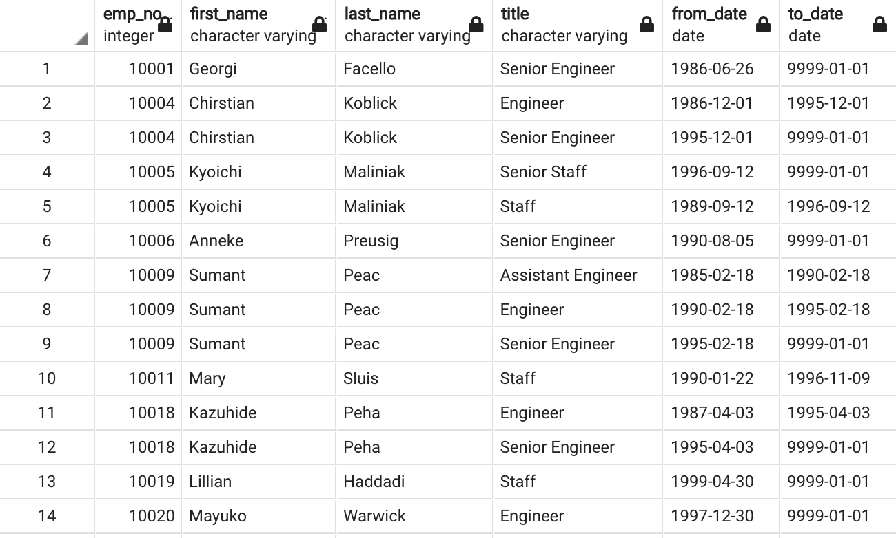
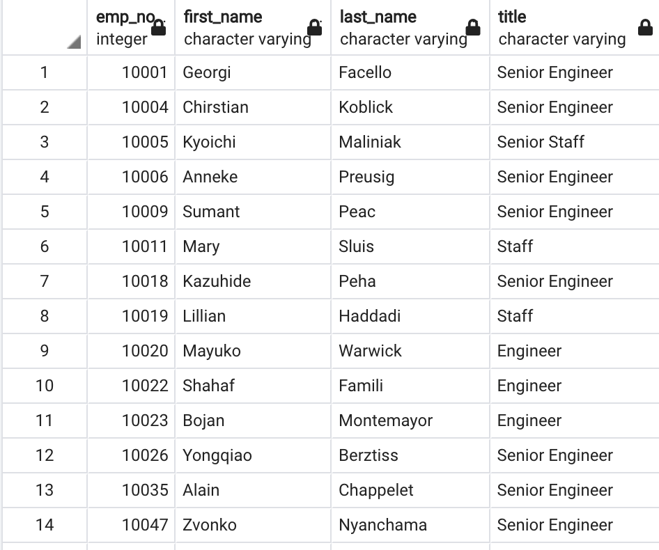
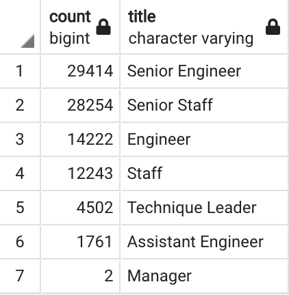
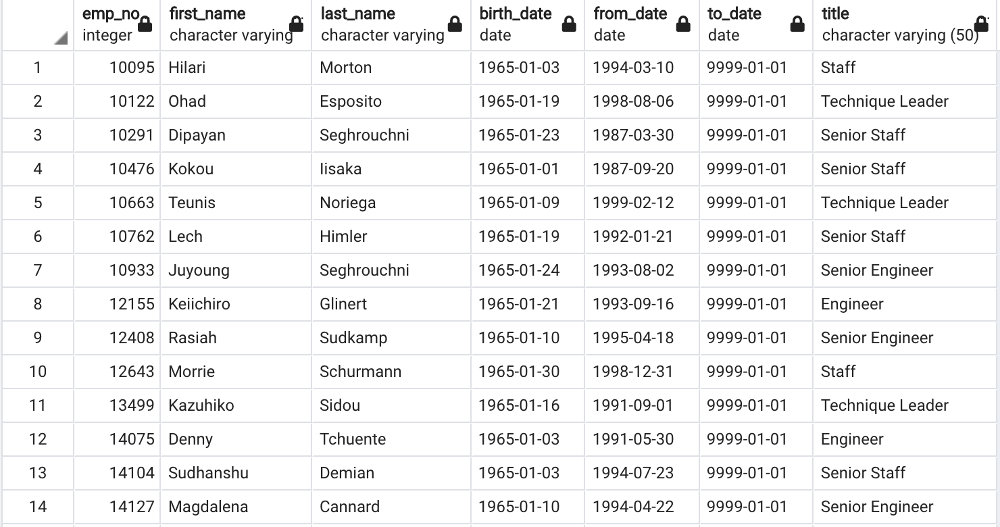

# Pewlett-Hackard-Analysis

## Overview of the analysis
Bobby's manager likes what we have done so far in SQL, and has given us two more assignments. We need to determine the number of retiring employees per title, and identify employees who are eligible to participate in a mentorship program.

### Purpose
The purpose of this assignment is to make two technical analysis deliverables: one that determines the number of retiring employees per title, andone that identifies employees who are eligible to participate in a mentorship program. These analyses will help Pewlett-Hackard prepare for a wave of retirees.

## Results
For the first deliverable, we created the retirement_tables query, which joined the employees table and the titles table. This table shows every retiring employee and all the titles they've held at Pewlett-Hackard. 



We then took this table and filtered it to only show the current titles held by people who will be retiring, and called it retiring_titles.



We used the unique_titles table and counted the number of titles, to see how many people will be retiring from each position.



Lastly, for our second deliverable, we created a table that shows mentorship eligibility. These people include current employees that were born in the year 1965.



We can take away four major points from these analyses. The first is that there is a large number of people retiring from the company. The second is that the majority of people retiring are coming from Senior Engineer and Senior Staff positions. There are also only two Managers retiring. We can also see that the number of people eligible to mentor younger employees is smaller than the amount of people leaving.


## Summary

With all the people retiring from Pewlett-Hackard, many spots will need to be filled. According to our retiring_titles table, we will lose 29,414 Senior Engineers, 28,254 Senior Staff, 14,222 Engineers, 12,243 Staff, 4,502 Technique Leaders, 1,761 Assistant Engineers, and 2 Managers. In total, 90,398 positions will need to be filled. Based on our mentorship_eligibility table, there are only 1,549 people qualified to train the next generation of employees. Our current_emp table shows that there are 33,118 current employees. This seems like a small number or mentors compared to the amount of people retiring, and the remaining employees.

In order to better prepare for the "silver tsunami", we can make a query to figure out the salaries for the people who will be retiring. 

``` 
-- Salaries for Retiring People
SELECT ut.emp_no,
ut.first_name,
ut.last_name,
ut.title,
s.salary
FROM unique_titles as ut
LEFT JOIN salaries as s
ON (ut.emp_no = s.emp_no)
ORDER BY ut.emp_no; 
```
We can also figure out what which departments are going to lose the most people.

```
-- Retiring Departments
SELECT ut.emp_no,
ut.first_name,
ut.last_name,
de.dept_no
INTO retiring_depts
FROM unique_titles as ut
LEFT JOIN dept_emp as de
ON (ut.emp_no = de.emp_no)
ORDER BY ut.emp_no;

SELECT COUNT (dept_no),
dept_no
INTO retiring_depts_count
FROM retiring_depts
GROUP BY dept_no
ORDER BY COUNT DESC;
```

These additional queries will help Bobby's manager plan better for the retirement wave.